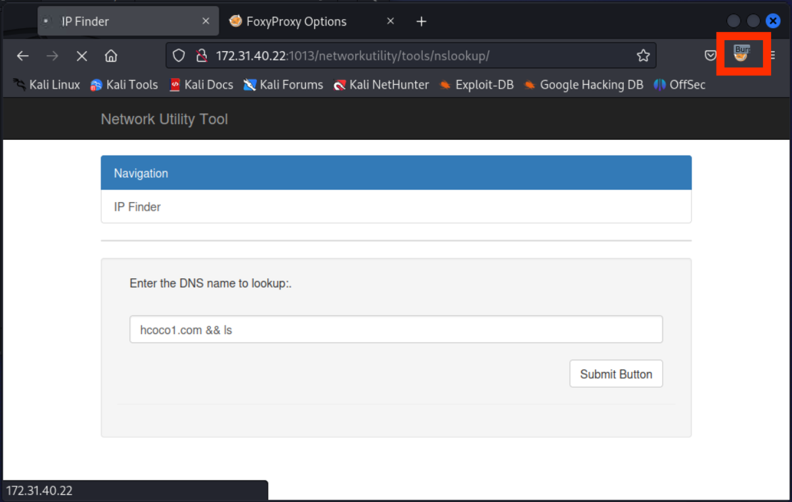
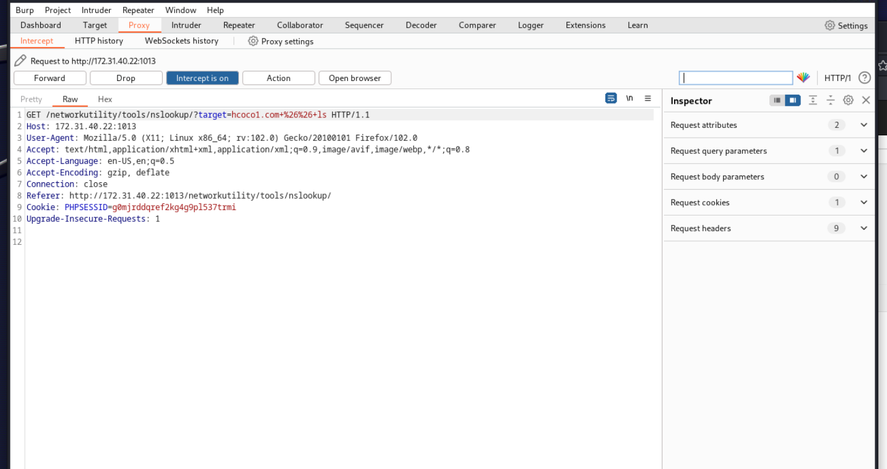
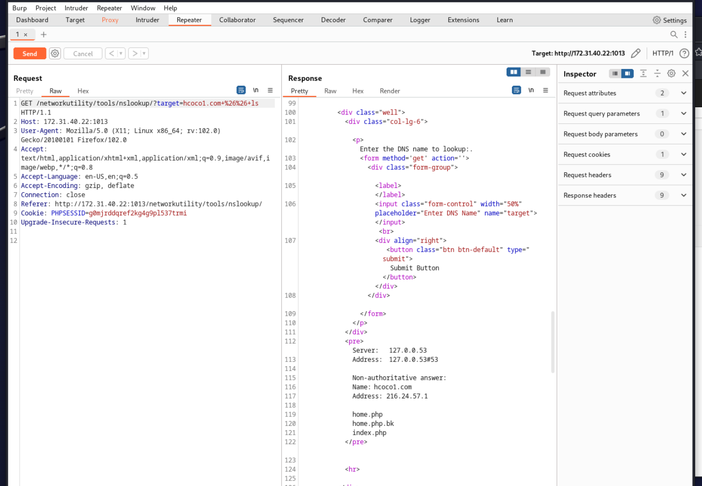
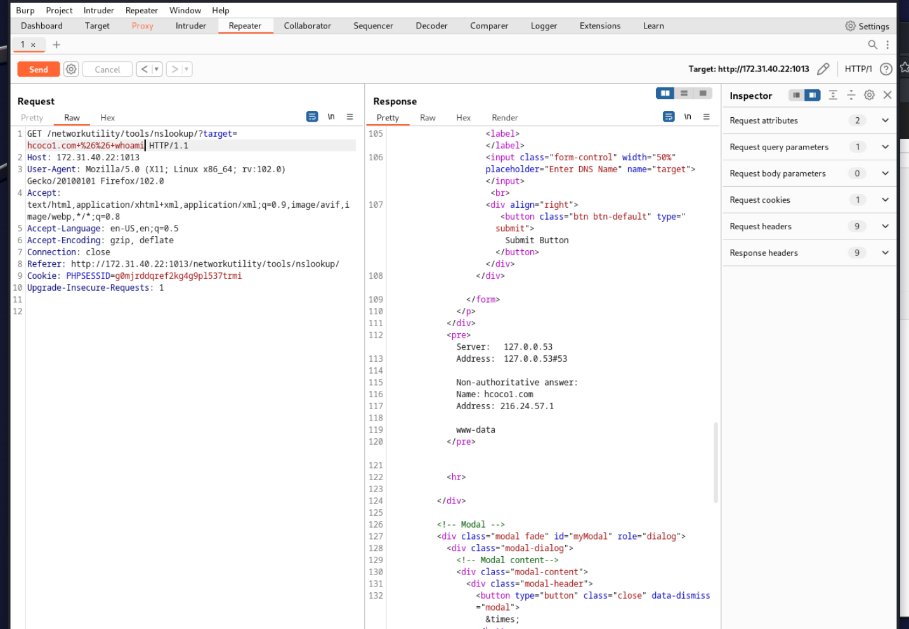
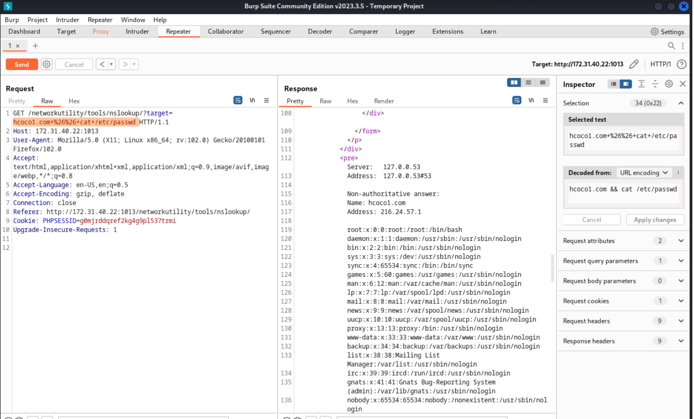

# **Challenge 2: Initial Compromise**
!!! note ""
## **Procedure:**

Next, we need to find our initial compromise vector. Servers hosting openly accessible services, like websites and unsecured databases, are great places to start.

- Access the site hosted on the webserver you found in the previous step.
  - **Hint:** How do you access a website on a custom port number?
- Explore the web pages available to you. What would be a good place to attempt some attacks?
  - **Hint:** Your first goal should be to test anything that handles user input.
- Demonstrate you can run commands on the target system by running the `whoami` command.

## **Solution:**

### OPTION 1 (Manually)

### Access the site hosted on the webserver 172.31.40.22:1013

```python linenums="1"
┌──(kali㉿kali)-[~]
└─$ firefox 172.31.40.22:1013
```


### Accesing the **[Apache server](https://kinsta.com/knowledgebase/what-is-apache/)**.


### The input allows us to perform a **[SQL injection Attack](https://portswigger.net/web-security/sql-injection)**


### Accesing the **[passwd file](https://www.geeksforgeeks.org/understanding-the-etc-passwd-file/)**.


## Successful SQL Injection Attack

### OPTION 2 (Using Burp Suite Community Edition)

- Intercepting the request in the Proxy Tab





- Sending the request to the Repeater Tab and testing the `ls` command



- Testing the `whoami` command



- Testing the `cat /etc/passwd` command



## Successful SQL Injection Attack

<div id="disqus_thread"></div>
<script>
    /**
    *  RECOMMENDED CONFIGURATION VARIABLES: EDIT AND UNCOMMENT THE SECTION BELOW TO INSERT DYNAMIC VALUES FROM YOUR PLATFORM OR CMS.
    *  LEARN WHY DEFINING THESE VARIABLES IS IMPORTANT: https://disqus.com/admin/universalcode/#configuration-variables    */
    /*
    var disqus_config = function () {
    this.page.url = PAGE_URL;  // Replace PAGE_URL with your page's canonical URL variable
    this.page.identifier = PAGE_IDENTIFIER; // Replace PAGE_IDENTIFIER with your page's unique identifier variable
    };
    */
    (function() { // DON'T EDIT BELOW THIS LINE
    var d = document, s = d.createElement('script');
    s.src = 'https://hcoco1-1.disqus.com/embed.js';
    s.setAttribute('data-timestamp', +new Date());
    (d.head || d.body).appendChild(s);
    })();
</script>
<noscript>Please enable JavaScript to view the <a href="https://disqus.com/?ref_noscript">comments powered by Disqus.</a></noscript>

!!! note ""

<div class="button-container" markdown="1">
<a href="/Career-Simulation-3/challenge_1/" class="md-button md-button--primary">Previous: Challenge 1</a>
<a href="/Career-Simulation-3/" class="md-button md-button--secondary">Home 🏠</a>
<a href="/Career-Simulation-3/challenge_3/" class="md-button md-button--primary">Next: Challenge 3</a>
</div>